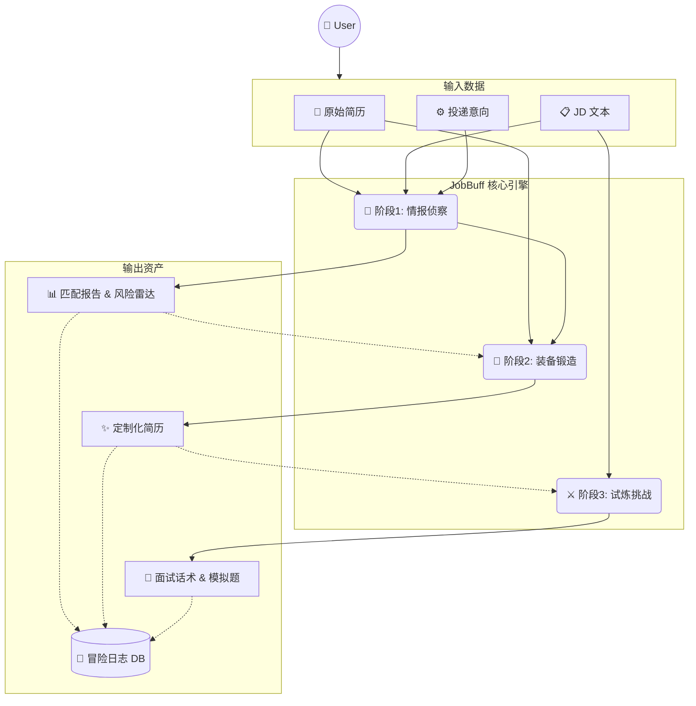

# JobBuff (职场外挂) 🎮

> 一站式 AI 求职辅助工具 —— "读得透、改得快、记得住"

## 📖 项目简介

JobBuff 是一个**游戏化全链路求职辅助工具**，帮助求职者：

1. **情报侦察** 📡 —— 深度解析 JD，识别隐藏要求和风险信号
2. **装备锻造** 🔨 —— AI 全权代笔重写简历，生成句子级 Diff
3. **试炼挑战** ⚔️ —— 生成模拟面试题，提供 AI 点评

## 🎯 核心功能

| 阶段 | 功能 | 描述 |
| :--- | :--- | :--- |
| 阶段 1 | 接取任务 | 上传简历 + 粘贴 JD |
| 阶段 2 | 情报侦察 | JD 洞察 + 匹配度评分 + 雷达图 |
| 阶段 3 | 装备锻造 | 简历重写 + 句子级 Diff + PDF 导出 |
| 阶段 4 | 试炼挑战 | 投递策略 + 话术 + 面试题 |
| 阶段 5 | 冒险日志 | 历史任务管理 + 数据可视化 |

## 🔄 数据流转 (Data Flow)



## 📂 项目结构

```
JobBuff/
├── .agent/
│   └── skills/           # AI Prompts (Antigravity Skills)
│       ├── jobbuff-intel/        # 情报侦察 (合并版)
│       ├── jobbuff-resume-forge/ # 简历锻造
│       ├── jobbuff-action-plan/  # 投递策略
│       ├── jobbuff-interview/    # 模拟面试
│       └── ui-ux-pro-max/        # UI/UX 设计助手
├── docs/                 # 产品文档
│   ├── PRD_岗位智能分析助手.md
│   ├── UI_UX_Design_JobBuff.md
│   ├── Prompt_Design_JobBuff.md
│   ├── Development_Plan.md
│   └── 用户故事_岗位智能分析助手.md
└── README.md
```

## 🛠️ 技术栈 (规划)

- **前端**: Next.js + TailwindCSS
- **后端**: Supabase Edge Functions
- **AI**: Gemini Pro API
- **部署**: Vercel

## 🚀 快速开始

> 🚧 项目开发中...

```bash
# 克隆项目
git clone https://github.com/your-username/JobBuff.git

# 安装依赖
cd JobBuff
npm install

# 启动开发服务器
npm run dev
```

## 📄 文档

- [PRD 产品需求文档](./docs/PRD_岗位智能分析助手.md)
- [UI/UX 设计文档](./docs/UI_UX_Design_JobBuff.md)
- [Prompt 设计文档](./docs/Prompt_Design_JobBuff.md)
- [开发计划](./docs/Development_Plan.md)

## 🤝 贡献

欢迎提交 Issue 和 Pull Request！

## 📄 License

MIT License
