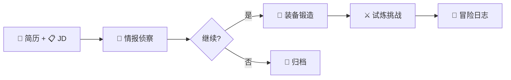

# JobBuff (职场外挂) 🎮

> 一站式 AI 求职辅助工具 —— **"读得透、改得快、记得住"**

[](https://nextjs.org/)
[](https://supabase.com/)
[](https://vercel.com/)

<p align="center">
  
</p>

## ✨ 产品亮点

仅需 **10 秒**，即可将一份 Raw JD 转化为包含**风险预警、定制简历与面试攻略**的全套作战方案，以"打怪升级"的轻松心态消解求职内耗。

---

## 🎯 核心功能

| 阶段 | 功能 | 描述 |
| :---: | :--- | :--- |
| 📝 | **接取任务** | 粘贴 JD + 上传简历，一键开启分析 |
| 📡 | **情报侦察** | JD 深度解析 + 风险雷达 + 匹配度评分 (雷达图) |
| 🔨 | **装备锻造** | AI 全权代笔简历重写 + 句子级 Diff + PDF 导出 |
| ⚔️ | **试炼挑战** | 投递策略分档 + 3 种话术 + 5 道面试题 + AI 点评 |
| 📜 | **冒险日志** | 任务历史管理 + 战绩统计 + 数据可视化 |

---

## 🛠️ 技术栈

| 层级 | 技术 |
| :--- | :--- |
| **前端** | Next.js 16 + React 19 + CSS Modules |
| **后端** | Next.js API Routes (Serverless) |
| **数据库** | Supabase (PostgreSQL + Auth) |
| **AI** | Gemini 3 Flash Preview (via AIHubMix) |
| **部署** | Vercel |
| **UI 风格** | 像素游戏风 (Pixel Art) |

---

## 🚀 快速开始

### 前置要求

- Node.js 18+
- Supabase 账号 (免费)
- LLM API Key (支持 OpenAI/Gemini/Claude 等)

### 1. 克隆项目

```bash
git clone https://github.com/your-username/JobBuff.git
cd JobBuff/frontend
```

### 2. 安装依赖

```bash
npm install
```

### 3. 配置环境变量

复制 `.env.example` 为 `.env.local` 并填写：

```env
# LLM 配置
LLM_API_KEY=sk-xxxxx
LLM_BASE_URL=https://aihubmix.com/v1
LLM_MODEL=gemini-3-flash-preview

# Supabase 配置
NEXT_PUBLIC_SUPABASE_URL=https://xxxxx.supabase.co
NEXT_PUBLIC_SUPABASE_ANON_KEY=eyJhbGciOi...
```

### 4. 初始化 Supabase 数据库

在 Supabase SQL Editor 执行 [docs/sql/init.sql](docs/sql/init.sql) 创建表结构。

### 5. 启动开发服务器

```bash
npm run dev
```

访问 <http://localhost:3000> 开始使用！

---

## 📂 项目结构

```
JobBuff/
├── frontend/                 # Next.js 前端应用
│   ├── app/                  # App Router 页面
│   │   ├── api/              # API Routes
│   │   ├── quest/            # 任务相关页面
│   │   ├── log/              # 冒险日志页面
│   │   └── login/            # 登录页面
│   ├── components/           # React 组件
│   │   ├── ui/               # 通用 UI 组件
│   │   ├── shared/           # 布局组件
│   │   └── features/         # 业务组件
│   └── lib/                  # 工具函数
│       ├── supabase/         # Supabase 客户端
│       └── prompts.ts        # AI Prompts
├── docs/                     # 产品文档
└── .agent/skills/            # AI Skill 定义
```

---

## 🔄 数据流转



---

## 🔐 用户系统

- **邮箱密码登录** (Supabase Auth)
- **免费额度**: 每用户 10 次分析
- **数据隔离**: 行级安全策略 (RLS)

---

## 📄 相关文档

| 文档 | 描述 |
| :--- | :--- |
| [PRD 产品需求文档](./docs/PRD_岗位智能分析助手.md) | 完整功能需求 |
| [UI/UX 设计文档](./docs/UI_UX_Design_JobBuff.md) | 设计规范 |
| [Prompt 设计文档](./docs/Prompt_Design_JobBuff.md) | AI Prompt 设计 |

---

## 🤝 贡献

欢迎提交 Issue 和 Pull Request！

---

## 📄 License

MIT License

---

<p align="center">
  Made with ❤️ by JobBuff Team
</p>
