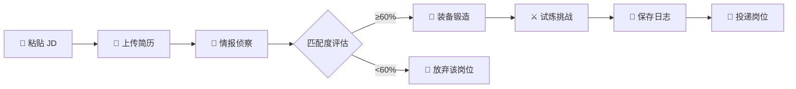

<div align="center">

# 🎮 JobBuff (职场外挂)

### AI-Powered Job Application Assistant

**把求职变成打怪升级 —— 读懂 JD、优化简历、模拟面试，一站搞定**

[](https://nextjs.org/)
[](https://react.dev/)
[](https://supabase.com/)
[](https://deepmind.google/technologies/gemini/)
[](LICENSE)

[🚀 在线体验](https://jobbuff.vercel.app) · [📖 产品文档](./docs/PRD_岗位智能分析助手.md) · [🐛 报告问题](https://github.com/your-username/JobBuff/issues)

---


</div>

## 🌟 为什么选择 JobBuff?

> **"投了 100 份简历，只收到 3 个面试"** —— 这是大多数求职者的真实写照。

问题不是你不够优秀，而是你的简历没有精准匹配 JD 的隐藏需求。

JobBuff 用 **AI 帮你读透 JD**，找出企业真正想要什么，然后 **定制化重写简历**，最后通过 **模拟面试** 帮你提前准备。

| 传统求职 | 使用 JobBuff |
|----------|--------------|
| 📖 手动逐字分析 JD | 🚀 10 秒自动解析，风险预警 |
| ✍️ 通用简历海投 | 🎯 AI 定制，句子级优化 |
| 😰 面试即兴发挥 | 🎮 预知问题，模拟演练 |

---

## ✨ 核心功能

<table>
<tr>
<td width="50%">

### 📡 情报侦察 (Intel)

- **JD 深度解析** - 识别显性需求、隐藏需求、风险预警
- **匹配度评分** - 五维雷达图可视化展示
- **SWOT 分析** - 知己知彼，百战不殆

</td>
<td width="50%">

### 🔨 装备锻造 (Forge)

- **AI 全权代笔** - 不堆技术话语，突出解决问题能力
- **句子级 Diff** - 每处修改都可接受/拒绝
- **一键导出** - Markdown / PDF 格式

</td>
</tr>
<tr>
<td width="50%">

### ⚔️ 试炼挑战 (Trial)

- **投递策略** - A/B/C/D 分档建议
- **开场话术** - 专业风 / 热情风 / 简洁风
- **模拟面试** - 5 道针对性问题 + AI 点评

</td>
<td width="50%">

### 📜 冒险日志 (Log)

- **全量历史** - 所有分析结果永久保存
- **数据同步** - 跨设备访问，数据不丢失
- **一键复盘** - 随时回顾优化方案

</td>
</tr>
</table>

---

## 🎯 用户旅程



---

## 🛠️ 技术架构

```
┌─────────────────────────────────────────────────────────────┐
│                        Frontend                              │
│   Next.js 15 + React 19 + CSS Modules (Pixel Art Style)     │
└─────────────────────────────────────────────────────────────┘
                              │
                              ▼
┌─────────────────────────────────────────────────────────────┐
│                     API Layer (Serverless)                   │
│   /api/intel  │  /api/forge  │  /api/interview  │  /api/action│
└─────────────────────────────────────────────────────────────┘
                              │
              ┌───────────────┴───────────────┐
              ▼                               ▼
┌──────────────────────┐         ┌──────────────────────┐
│     Supabase         │         │     Gemini AI        │
│  ─────────────────   │         │  ─────────────────   │
│  • PostgreSQL        │         │  • JD 分析           │
│  • Auth (邮箱登录)    │         │  • 简历优化          │
│  • RLS 数据隔离       │         │  • 面试生成          │
└──────────────────────┘         └──────────────────────┘
```

| 模块 | 技术选型 | 说明 |
|------|----------|------|
| **前端框架** | Next.js 15 (App Router) | 服务端渲染 + API Routes |
| **UI 框架** | React 19 + CSS Modules | 像素游戏风格设计系统 |
| **数据库** | Supabase (PostgreSQL) | 用户数据、任务存储 |
| **认证** | Supabase Auth | 邮箱密码登录 |
| **AI 引擎** | Gemini 2.0 Flash | JD 分析、简历优化、面试生成 |
| **部署** | Vercel | 边缘函数，全球加速 |

---

## 📂 项目结构

```
JobBuff/
├── frontend/                     # 🖥️ Next.js 前端应用
│   ├── app/                      # App Router 页面
│   │   ├── api/                  # Serverless API
│   │   │   ├── intel/            # 情报分析 API
│   │   │   ├── forge/            # 简历重铸 API
│   │   │   ├── interview/        # 模拟面试 API
│   │   │   └── action/           # 投递策略 API
│   │   ├── quest/                # 任务页面
│   │   │   ├── new/              # 新建任务
│   │   │   └── [id]/             # 任务详情 (情报/锻造/试炼)
│   │   ├── log/                  # 冒险日志
│   │   ├── profile/              # 用户中心
│   │   └── login/                # 登录注册
│   ├── components/               # React 组件库
│   │   ├── ui/                   # 通用 UI (Button, Card, Modal...)
│   │   ├── shared/               # 布局组件 (Navbar, Footer...)
│   │   └── features/             # 业务组件 (DiffCard, RadarChart...)
│   ├── lib/                      # 工具库
│   │   ├── supabase/             # Supabase 客户端 + CRUD
│   │   └── prompts.ts            # AI Prompt 模板
│   └── styles/                   # 全局样式 + 设计 Tokens
│
├── docs/                         # 📖 产品文档
│   ├── PRD_岗位智能分析助手.md    # 产品需求文档
│   ├── UI_UX_Design_JobBuff.md   # 设计规范
│   └── sql/                      # 数据库初始化脚本
│
└── .agent/skills/                # 🤖 AI Skill 定义
    ├── jobbuff-intel/            # 情报分析技能
    ├── jobbuff-resume-forge/     # 简历锻造技能
    ├── jobbuff-interview/        # 模拟面试技能
    └── jobbuff-action-plan/      # 投递策略技能
```

---

## 🚀 快速开始

### 环境要求

- **Node.js** 18+
- **Supabase** 账号 ([免费注册](https://supabase.com/))
- **LLM API Key** (Gemini / OpenAI / Claude 均可)

### 1️⃣ 克隆仓库

```bash
git clone https://github.com/your-username/JobBuff.git
cd JobBuff/frontend
```

### 2️⃣ 安装依赖

```bash
npm install
```

### 3️⃣ 配置环境变量

```bash
cp .env.example .env.local
```

编辑 `.env.local`：

```env
# 🔑 LLM 配置
LLM_API_KEY=your-api-key
LLM_BASE_URL=https://aihubmix.com/v1
LLM_MODEL=gemini-2.0-flash

# 🗄️ Supabase 配置
NEXT_PUBLIC_SUPABASE_URL=https://xxxxx.supabase.co
NEXT_PUBLIC_SUPABASE_ANON_KEY=eyJhbGciOi...
```

### 4️⃣ 初始化数据库

在 Supabase SQL Editor 执行：

```bash
# 创建表结构
psql -f docs/sql/init.sql
```

### 5️⃣ 启动开发服务器

```bash
npm run dev
```

🎉 访问 <http://localhost:3000> 开始使用！

---

## 💳 配额系统

| 操作 | 配额消耗 |
|------|----------|
| 🆕 创建新任务分析 | **-1 次** |
| ❌ 分析失败 / 保存失败 | **不扣费** |
| 🔨 装备锻造 (同一任务) | **免费** |
| ⚔️ 试炼挑战 (同一任务) | **免费** |
| 📜 历史任务查看 | **免费** |

> 🆓 免费用户：10 次分析配额
> ⭐ Pro 会员：敬请期待

---

## 🗺️ 路线图

- [x] ~~JD 深度分析 + 风险预警~~
- [x] ~~AI 简历重写 + Diff 对比~~
- [x] ~~模拟面试 + AI 点评~~
- [x] ~~用户认证 + 数据云存储~~
- [x] ~~配额系统 + 用户中心~~
- [ ] 🔜 简历素材库 (跨任务复用)
- [ ] 🔜 批量任务导入
- [ ] 🔜 Chrome 插件一键采集

---

## 📸 界面预览

<details>
<summary>点击展开截图</summary>

| 情报侦察 | 装备锻造 |
|----------|----------|
|  |  |

| 试炼挑战 | 冒险日志 |
|----------|----------|
|  |  |

</details>

---

## 🤝 贡献指南

我们欢迎任何形式的贡献！

1. **Fork** 本仓库
2. 创建功能分支 (`git checkout -b feature/amazing-feature`)
3. 提交更改 (`git commit -m 'Add amazing feature'`)
4. 推送分支 (`git push origin feature/amazing-feature`)
5. 发起 **Pull Request**

---

## 📄 开源协议

本项目采用 [MIT License](LICENSE) 开源协议。

---

<div align="center">

**⭐ 如果觉得有帮助，请给个 Star 支持一下！**

Made with ❤️ by [JobBuff Team](https://github.com/your-username)

[报告 Bug](https://github.com/your-username/JobBuff/issues) · [功能建议](https://github.com/your-username/JobBuff/issues)

</div>
