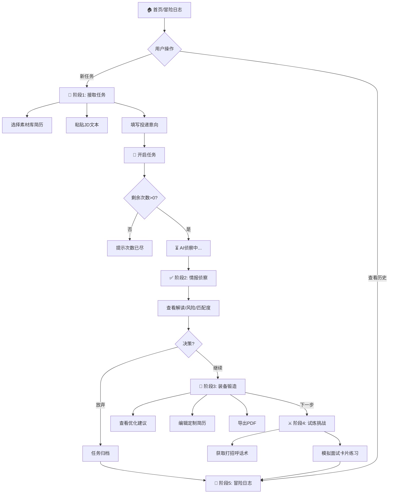
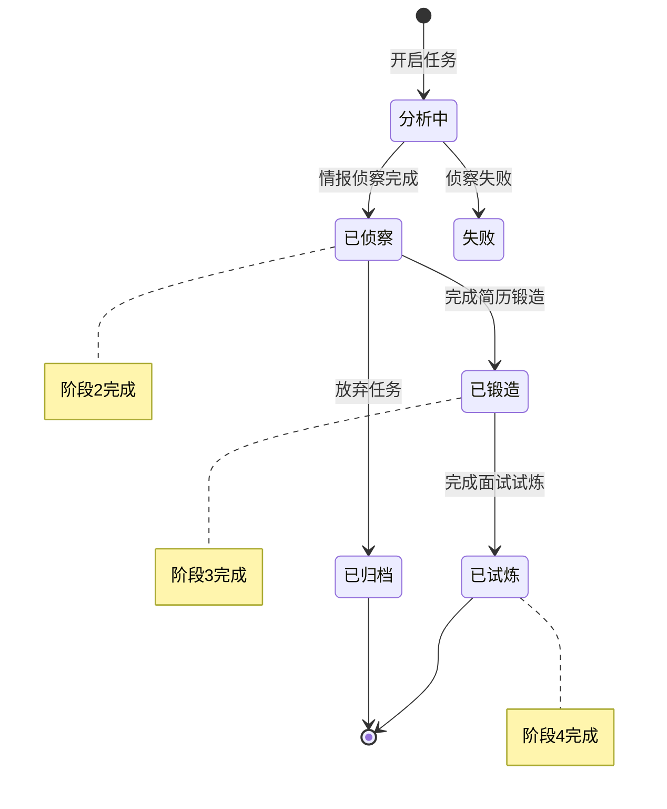

# PRD | JobBuff (职场外挂) v3.1

> *引用样式*
>
> 1. 需求文档只是你思考的沉淀，它既是思维框架，也可能是思维枷锁。
> 2. 形式不重要，重要的是**你能否表达清楚**。
> 3. 本文档命名规范：`PRD | JobBuff (职场外挂)`，数据相关命名 `数据 | JobBuff`。

---

## 1. 📝 背景 (Background)

### 现状 (As-Is)

当前求职者（尤其是Gap期、转型期或有ADHD倾向的用户）在面对海量岗位时，普遍存在以下痛点：

1. **启动成本高**：每次投递都需要经过"读JD -> 改简历 -> 准备话术 -> 模拟面试"的漫长流程，容易在第一步就产生畏难情绪。
2. **决策依据模糊**：JD描述往往充满"黑话"（如"弹性工作"实为996），求职者难以识别潜在风险，导致通过率低。
3. **沉淀缺失**：针对每个岗位的调研、修改版本和思考过程无法保存，经验难以复用，每次都要从零开始。

### 机会 (Opportunity)

利用AI大模型能力，打造一个**游戏化全链路求职辅助工具**：

1. **一站式决策**：输入JD+简历+意向，直接给出深度解读与匹配度，辅助决策。
2. **自动化准备**：AI自动生成定制简历、投递话术、模拟面试题，将准备时间从小时级压缩到分钟级。
3. **资产化管理**：将每一次投递过程转化为可复盘的数据资产（冒险日志），帮助用户科学管理求职进度。

#### ✨ 产品亮点 (Highlights)

**"读得透、改得快、记得住"** —— 仅需10秒，即可将一份Raw JD转化为包含风险预警、定制简历与面试攻略的全套作战方案，以“打怪升级”的轻松心态消解求职内耗。

---

## 2. 🎯 目标 (Goals)

1. **核心功能闭环**：实现从"接取任务"到"试炼挑战"的全流程AI辅助，覆盖侦察、锻造、试炼三个核心阶段。
2. **用户体验目标**：通过"游戏化任务流"的交互模式，降低用户认知负荷；单次完整分析耗时控制在 15s 以内。
3. **数据目标（MVP）**：
    - **分析完成率**：≥ 90%（用户发起分析后成功获取结果的比例）。
    - **准备转化率**：≥ 40%（看完解读后进入"装备锻造"阶段的比例）。
    - **7日留存率**：≥ 30%。

---

## 3. 🔭 范围 (Scope)

基于五层拆解，MVP阶段范围如下：

1. **触达层 (Touchpoint Layer)**：
    - 面向所有用户的 **Web浏览器访问** (Chrome/Edge/Safari等主流桌面浏览器)。
    - 浏览器插件为未来扩展 (v1.0)，本阶段仅预留架构接口。

2. **部署层 (Deployment Layer)**：
    - **前端**：部署在 Vercel 上的响应式静态网站 (Next.js)，通过独立域名访问。
    - **后端**：核心业务逻辑与 AI 编排服务部署为云函数 (Supabase Edge Functions / Vercel Serverless)。

3. **形态层 (Form Factor Layer)**：单页应用 (SPA)，包含：
    - **输入区**：三要素表单（简历选择器、JD文本粘贴框、意向输入框）、开始任务按钮。
    - **展示区**：分阶段的结果呈现页（情报侦察页雷达图、装备锻造页简历预览、试炼挑战页卡片流、冒险日志页BI图表）。
    - **操作区**：各阶段流转按钮（"去锻造"、"去试炼"）、全局导航、导出/复制交互组件。

4. **服务层 (Service Layer)**：
    - **智能分析与生成服务**：调用 LLM (Gemini Pro) 进行长文本 JD 解析、风险识别、简历重写及模拟面试点评。
    - **文件处理服务**：多格式简历解析 (PDF/Word -> Text) 及 定制简历 PDF 生成服务。
    - **账户与计费服务**：用户身份认证、免费次数额度管理、异常熔断处理。

5. **数据层 (Data Layer)**：
    - **用户资产库**：用户上传的原始简历文件、生成的定制简历版本。
    - **业务数据表**：岗位分析记录 (含完整 JSON 结果)、岗位进度状态 (State)、用户偏好设置。
    - **运营数据**：用户对分析结果的显性反馈 (👍/👎)、功能使用漏斗埋点。

---

## 4. 🔗 流程 (Process)

### 4.1 核心业务流程图

用户从接任务到完成试炼的操作流向。



### 4.2 岗位记录状态流转图

每个岗位任务记录的生命周期管理。



---

## 5. 💻 需求详情 (Requirement Details)

### 5.1 阶段1：接取任务 (Quest Input)

| 页面模块 | 需求详情 (Details) | 交互原型/备注 (Interaction/Notes) |
| :--- | :--- | :--- |
| **简历选择** | 1. 下拉展示已上传的素材库简历文件。 2. 支持"＋上传新简历"（PDF/Word/MD），上限10MB。 3. 默认选中最近使用的一份。 | 必须校验是否选择了简历，否则无法计算匹配度。 |
| **JD输入框** | 1. 多行文本框，支持粘贴纯文本。 2. 自动过滤HTML标签/Emoji/乱码。 3. 字数限制：50-10000字。 | 左下角实时显示字符数。 |
| **投递意向** | 1. **目标岗位**：单行文本（如"产品经理"）。 2. **目标薪资**：单行文本（如"25k-30k"）。 3. 必填项，作为AI分析的上下文参数。 | 也是必填项。 |
| **开启任务** | 1. 点击后校验所有必填项 + 剩余次数。 2. 校验通过：扣除1次额度（若是新岗位），跳转至Loading页。 3. 校验不通过：Toast提示具体原因。 | 按钮文案："🚀 开启侦察任务" |

**页面布局线框图 (ASCII Wireframe)**:

```text
+-------------------------------------------------------------+
|  接取新任务 (Quest Board)                         [剩余: 5次] |
+-------------------------------------------------------------+
|  1. 选择简历装备                                             |
|  [ 我的通用简历.pdf v ]  [+ 上传新装备]                       |
+-------------------------------------------------------------+
|  2. 任务描述 (JD)                                            |
|  +-------------------------------------------------------+  |
|  | 粘贴JD文本...                                          |  |
|  +-------------------------------------------------------+  |
+-------------------------------------------------------------+
|  3. 任务目标                                                 |
|  目标岗位: [ 产品经理 ]      目标薪资: [ 25k-35k ]            |
+-------------------------------------------------------------+
|                                           [ 🚀 开启侦察任务 ] |
+-------------------------------------------------------------+
```

### 5.2 阶段2：情报侦察 (Intel Scan)

| 页面模块 | 需求详情 (Details) | 交互原型/备注 (Interaction/Notes) |
| :--- | :--- | :--- |
| **顶部概览** | 展示岗位名称、公司名（AI提取）、分析时间。 | 吸顶展示。 |
| **岗位解读** | 1. **核心职责**：3-5条白话版解读。 2. **能力要求**：提取硬性技能与软性素质。 | 列表展示。 |
| **风险雷达** | 1. 识别JD中的"坑"（如：弹性工作、抗压、无社保）。 2. 以⚠️标签高亮，点击显示解读文案。 | 若无风险，显示"暂无明显风险"。 |
| **匹配度评分** | 1. 展示总分（0-100）。 2. 雷达图维度：技能、经验、学历、行业、其他。 3. **AI情报总结**：一段客观的综合评价。 | 雷达图使用ECharts渲染。 |
| **底部操作** | 1. **[放弃任务]**：点击后弹窗确认，任务归档但不再继续流程。 2. **[去锻造装备]**：主按钮，跳转阶段3。 | 悬浮底部。 |

**页面布局线框图 (ASCII Wireframe)**:

```text
+-------------------------------------------------------------+
|  情报侦察：字节跳动 - 高级产品经理        [保存] [导出] [反馈] |
+-------------------------------------------------------------+
|  [ 📡 情报侦察 ]   [ 🔨 装备锻造 ]   [ ⚔️ 试炼挑战 ]          |
+-------------------------------------------------------------+
|  战力评分: 78分  (匹配度良好)                                 |
|  [雷达图区域]                                                |
+-------------------------------------------------------------+
|  ⚠️ 风险陷阱                                                 |
|  - "弹性工作制": 可能存在高强度加班风险...                     |
+-------------------------------------------------------------+
|  💡 深度情报                                                 |
|  1. 核心是做B端SaaS...                                       |
+-------------------------------------------------------------+
|  🤖 参谋总结                                                 |
|  该岗位技术要求较高，薪资符合预期，建议重点准备...              |
+-------------------------------------------------------------+
|                    [ 下一步：去锻造装备 > ]                   |
+-------------------------------------------------------------+
```

### 5.3 阶段3：装备锻造 (The Forge)

| 页面模块 | 需求详情 (Details) | 交互原型/备注 (Interaction/Notes) |
| :--- | :--- | :--- |
| **锻造总览** | 展示本次锻造的改动数量、预计匹配度提升、AI 判定的风格类型（大厂/外企/国企/初创）。 | 顶部概览卡片。 |
| **改动清单 (Diff)** | 1. AI 全权代笔生成完整优化版简历。 2. 以**句子级 Diff 卡片**展示每个改动点，包含：原文、锻造后、修改理由。 3. 每条改动可**单独接受/拒绝**。 4. 支持**一键全部接受**。 | 左侧列表，卡片形式展示改动。 |
| **简历预览** | 1. 右侧实时展示最终简历效果（基于已接受的改动）。 2. 可切换为**编辑模式**（富文本），用户手动微调。 | 右侧预览区，接受改动后实时更新。 |
| **未匹配能力提示** | 列出 JD 要求但用户简历未体现的能力（AI 不会编造，仅提醒）。 | 底部折叠面板，建议用户自行补充。 |
| **导出功能** | 1. **导出 PDF**：标准简约商务风格式。 2. **复制 Markdown**：纯文本版本，便于粘贴到其他平台。 | 按钮位于预览区右上角。 |
| **风格重选** | 用户可点击"重新生成"，手动选择目标风格（大厂/外企/国企/初创），AI 将按新风格重新锻造。 | 在锻造总览区，下拉选择 + 重新生成按钮。 |
| **底部操作** | 1. **[上一步]**：返回侦察页。 2. **[去试炼挑战]**：主按钮，跳转阶段4。 | 可跳过本阶段直接去试炼。 |

**页面布局线框图 (ASCII Wireframe)**:

```text
+-------------------------------------------------------------+
|  装备锻造                    [风格: 大厂风 v] [重新生成]      |
+-------------------------------------------------------------+
|  📊 锻造总览：优化了 6 处，预计匹配度 +15%                    |
+-------------------------------------------------------------+
|                                                             |
|  📝 改动清单 (左侧)           |  📄 简历预览 (右侧)          |
|  +-------------------------+ |  +------------------------+ |
|  | 🔧 修改点 1: 个人简介     | |  |  张三                   | |
|  |    Before: AI Native... | |  |  AI 产品专家            | |
|  |    After:  AI 产品专家...| |  |  ...                    | |
|  |    理由: 植入JD关键词    | |  |  (实时更新)              | |
|  |    [✓ 接受] [✗ 拒绝]     | |  +------------------------+ |
|  +-------------------------+ |                              |
|  | 🔧 修改点 2: 项目经历     | |  [预览模式] [编辑模式]       |
|  |    ...                   | |                              |
|  +-------------------------+ |                              |
|                              |                              |
|  [全部接受]                  |  [导出PDF] [复制Markdown]    |
+-------------------------------------------------------------+
|  ⚠️ JD 要求但简历未体现: RAG 直接实践经验 [点击了解如何补充]  |
+-------------------------------------------------------------+
|      [ < 上一步 ]                 [ 下一步：去试炼挑战 > ]    |
+-------------------------------------------------------------+
```

### 5.4 阶段4：试炼挑战 (The Trial)

| 页面模块 | 需求详情 (Details) | 交互原型/备注 (Interaction/Notes) |
| :--- | :--- | :--- |
| **开场白** | 1. 生成3条不同风格的开场话术（专业、热情、简洁）。 2. 每条右侧有[复制]按钮。 | 卡片列表展示。 |
| **模拟试炼** | 1. 展示5个基于JD的Boss挑战题（面试题）。 2. 点击卡片展开。 3. 包含：[输入回答框]、[AI参考攻略]、[AI点评]（提交回答后显示）。 | 手风琴折叠效果。 |
| **底部操作** | 1. **[完成任务]**：点击后提示"恭喜通关"，跳转至冒险日志页。 | - |

**页面布局线框图 (ASCII Wireframe)**:

```text
+-------------------------------------------------------------+
|  试炼挑战                                                   |
+-------------------------------------------------------------+
|  👋 开场白技能                                              |
|  [ 话术1: 您好，我对... ]  [复制]                           |
|  [ 话术2: ...          ]  [复制]                           |
+-------------------------------------------------------------+
|  🎤 Boss挑战题                                              |
|  +-------------------------------------------------------+  |
|  | Q1: 请介绍一个你最成功的项目？                   [展开] |  |
|  +-------------------------------------------------------+  |
|  | Q2: 你如何处理需求变更？                         [收起] |  |
|  | ----------------------------------------------------- |  |
|  | 你的回答: [ 输入回答... ]           [ 提交点评 ]       |  |
|  | ----------------------------------------------------- |  |
|  | 🤖 战后点评: 逻辑清晰，暴击点在于数据支撑...            |  |
|  +-------------------------------------------------------+  |
+-------------------------------------------------------------+
|                      [ ✅ 完成所有挑战 ]                     |
+-------------------------------------------------------------+
```

### 5.5 阶段5：冒险日志 (Adventure Log)

| 页面模块 | 需求详情 (Details) | 交互原型/备注 (Interaction/Notes) |
| :--- | :--- | :--- |
| **战绩概览** | 展示指标：总任务数、本周新增、平均战力(匹配度)、已完成装备数。 | 顶部4个指标卡片。 |
| **战绩分布** | Tab切换展示： 1. **概览**：任务进度漏斗。 2. **分布**：按公司/薪资/行业的饼图或柱状图。 3. **趋势**：战力变化折线图。 | ECharts图表。 |
| **历史任务** | 1. 卡片列表，按时间倒序。 2. 卡片内容：公司、岗位、薪资、战力、**进度条**(侦察/锻造/试炼)。 3. **操作**：[查看详情]、[继续锻造]、[开始试炼]（根据进度动态显示）。 | 点击操作跳转回对应阶段页面。 |

**页面布局线框图 (ASCII Wireframe)**:

```text
+-------------------------------------------------------------+
|  我的冒险日志                                                |
+-------------------------------------------------------------+
|  [ 📊 总任务: 12 ]  [ 🎯 平均战力: 72 ]  [ ✅ 已通关: 8 ]    |
+-------------------------------------------------------------+
|  战绩图表: [ 任务 v ] [ 公司 ] [ 薪资 ]                      |
|  (此处展示饼图/柱状图...)                                     |
+-------------------------------------------------------------+
|  历史任务列表                                [ 🔍 搜索... ]  |
|  +-------------------------------------------------------+  |
|  | 字节跳动 · 产品经理                2026-01-20         |  |
|  | 💰 25-40k   🎯 战力: 78 (↑5)                          |  |
|  | 进度: [✅侦察]──[✅锻造]──[⬜试炼]                     |  |
|  | [ 查看详情 ]  [ 继续锻造 ]  [ 开始试炼 ]               |  |
|  +-------------------------------------------------------+  |
|  ...                                                        |
+-------------------------------------------------------------+
```

---

## 6. 📊 数据埋点 (Data Tracking)

### 6.1 核心分析思路

关注用户的**漏斗转化率**（输入->判断->准备->实战）以及**功能使用深度**（是否编辑简历、是否练习面试题）。

### 6.2 埋点清单

| 事件名称 | 事件ID (snake_case) | 事件描述 | 事件参数名称 | 事件参数取值 | 补充说明 |
| :--- | :--- | :--- | :--- | :--- | :--- |
| 首页曝光 | `pv_home` | 进入首页/BI页 | `user_type` | `new/returning` | - |
| 发起分析 | `click_start_analysis` | 点击开始分析按钮 | `has_resume` | `bool` | 是否已选简历 |
| 分析完成 | `analysis_success` | AI成功返回结果 | `duration` | `ms` | 耗时 |
| 决策点击 | `click_decision` | 判断页底部按钮点击 | `action` | `archive/continue` | 放弃或继续 |
| 简历保存 | `click_save_resume` | 保存定制简历 | `edit_count` | `int` | 编辑次数 |
| 简历导出 | `click_export_pdf` | 导出PDF | - | - | - |
| 话术复制 | `click_copy_greeting` | 复制打招呼语 | `index` | `0/1/2` | - |
| 面试题提交 | `submit_interview_answer` | 提交面试回答 | `question_id` | `int` | - |
| 卡片跳转 | `click_history_action` | 从历史卡片点击操作 | `target_stage` | `evaluate/prepare/practice` | - |

---

## 7. 🛡️ 非功能性需求与约束

1. **性能要求**：
    - AI分析接口（阶段1->2）P95延迟 ≤ 20s（由于涉及长文本处理，允许较长Loading，需有进度提示）。
    - 其他接口 P95 ≤ 500ms。
2. **数据安全**：
    - 用户的**原始简历文件**必须加密存储。
    - **JD数据和分析结果**作为用户私有资产，不同步给第三方。
    - 明确声明：用户数据**不用于**公共模型训练。
3. **兼容性**：
    - Web端适配主流桌面浏览器（Chrome 80+, Edge, Safari）。
    - 暂不强制适配移动端Web。

---

## 8. 📝 待确认事项 (Open Questions)

| 事项描述 | 责任人 | 截止日期 |
| :--- | :--- | :--- |
| 1. AI服务的Token成本监控告警阈值设定 | 后端开发 | TBD |
| 2. 简历PDF导出的标准模板设计稿 | UI设计 | TBD |
| 3. 用户免费次数用尽后的具体引导文案（MVP暂无付费页） | 产品经理 | TBD |

---
*文档版本：v3.0*
*最后更新：2026-01-20*
