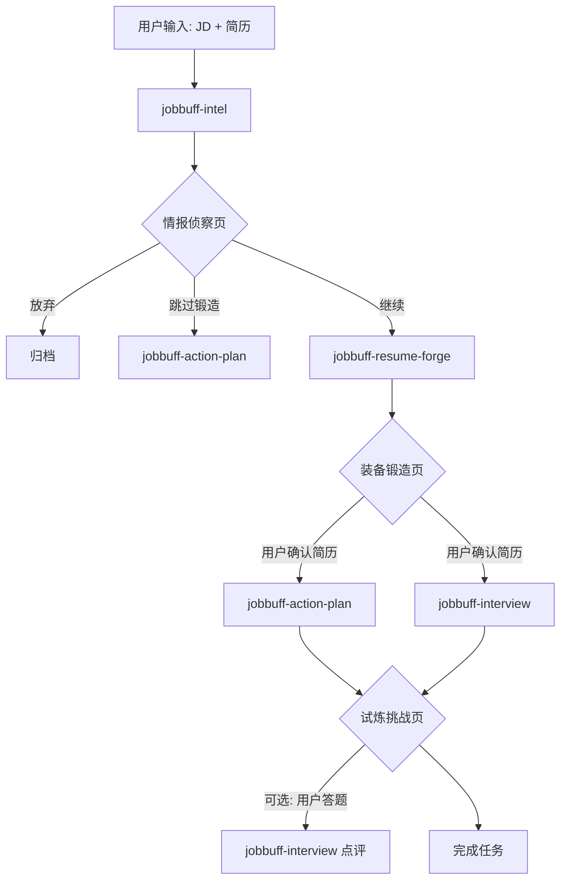

# 📚 JobBuff Prompt 设计文档 v2.0

> 本文档整理了 JobBuff 岗位智能分析助手的全部核心 Skill 的 Prompt 设计。

---

## 📊 Skills 总览

| 阶段 | Skill | 核心功能 | LLM 调用 |
| :--- | :--- | :--- | :--- |
| 情报侦察 | `jobbuff-intel` | JD 解析 + 匹配度评估 (合并) | 1 次 |
| 装备锻造 | `jobbuff-resume-forge` | AI 全权代笔、句子级 Diff | 1 次 |
| 试炼挑战 | `jobbuff-action-plan` | 投递策略、渠道建议、话术 | 1 次 |
| 试炼挑战 | `jobbuff-interview` | 面试题 + AI 点评 (可跳过) | 1 + N 次 |

---

## 🔗 数据流转图



---

## 📋 确认的设计决策

| 决策点 | 结论 |
| :--- | :--- |
| 情报侦察调用次数 | ✅ 合并为 1 次 (`jobbuff-intel`) |
| 面试题是否必做 | ✅ 可跳过 |
| 面试题基于哪个简历 | ✅ 若锻造：用锻造后简历；若跳过：用原始简历 |
| 进入试炼前 | ✅ 必须确认当前简历内容 |

---

## 1️⃣ jobbuff-intel (情报侦察 - 合并版)

**路径**: `.agent/skills/jobbuff-intel/SKILL.md`

### 输出结构

```json
{
  "jd_insight": {
    "role_reality": {},
    "requirements": {},
    "risk_assessment": {},
    "company_intel": {},
    "salary_analysis": {}
  },
  "match_analysis": {
    "overall_score": 0,
    "radar_chart": {},
    "swot": {},
    "gap_analysis": []
  },
  "verdict": {}
}
```

---

## 2️⃣ jobbuff-resume-forge (简历锻造)

**路径**: `.agent/skills/jobbuff-resume-forge/SKILL.md`

### 核心原则

- 🚨 严禁编造
- ✅ 句子级 Diff
- ✅ 【关键词】前缀
- ✅ 问题导向 (PAAR)

---

## 3️⃣ jobbuff-action-plan (投递策略)

**路径**: `.agent/skills/jobbuff-action-plan/SKILL.md`

### 输出

- 策略分档 (A/B/C/D)
- 渠道建议
- 3 种话术

---

## 4️⃣ jobbuff-interview (模拟面试)

**路径**: `.agent/skills/jobbuff-interview/SKILL.md`

### 核心功能

- 5 道面试题 (可跳过)
- 参考答案
- AI 点评用户回答

---

*文档版本：v2.0*
*最后更新：2026-01-21*
